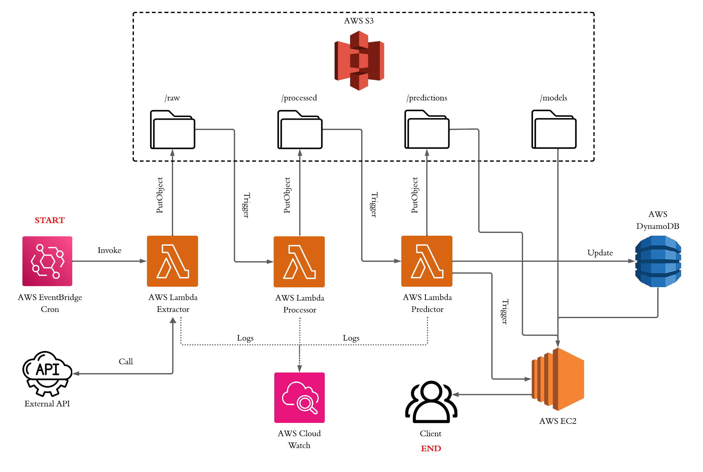

# Automated Loan Approval ML System

[](https://www.python.org/)
[](https://aws.amazon.com/)
[](https://scikit-learn.org/)
[](LICENSE)

End-to-end serverless machine learning pipeline for automated loan approval decisions using AWS services and Random Forest classification. I encourage you to explore the **notebooks/loan_approval_analysis.ipynb** notebook to understand the complete decision-making process, feature engineering rationale, and model selection considerations behind this implementation.

## Business Case

### Problem Statement
Manual loan approval processes create significant operational bottlenecks in financial institutions, with each application requiring time-consuming human review that leads to long processing times, inconsistent decisions due to human bias, high operational costs, and delayed customer responses.

### Solution
This ML-powered automated loan approval system delivers instant decisions with 90.46% precision, eliminating human bias through consistent criteria while reducing processing costs and enabling 24/7 real-time approvals that match historical bank decision-making standards.

---

## System Architecture



### Components

1. **Data Extraction (Lambda)**
   - Extracts loan applications from source (API/CSV/Database)
   - Stores raw data in S3 with timestamp partitioning

2. **Data Processing (Lambda)**
   - Validates and cleans application data
   - Feature engineering and transformation
   - Triggers ML prediction pipeline

3. **ML Prediction (Lambda + EC2)**
   - Lambda orchestrates prediction workflow
   - EC2 Flask API serves Random Forest model
   - Batch predictions with confidence scores

4. **Storage & Analytics**
   - **S3**: Raw data, processed data, predictions
   - **DynamoDB**: Real-time prediction results
   - **EC2 Dashboard**: Interactive analytics visualization

---

## Model Performance

| Metric | Value | Description |
|--------|-------|-------------|
| **Precision** | 90.46% | When model predicts approval, it matches bank decision 90.46% of time |
| **Recall** | 74.40% | Model identifies 74.40% of all actual approvals |
| **F1-Score** | 81.65% | Harmonic mean of precision and recall |
| **Accuracy** | 92.59% | Overall correct predictions |

### Model Details
- **Algorithm**: Random Forest Classifier
- **Training Set**: 36,000 applications
- **Test Set**: 9,000 applications
- **Features**: 14 (7 numeric + 7 categorical)
- **Cross-Validation**: 5-fold stratified

### Feature Importance
Top features driving decisions:
1. `loan_percent_income` - Loan amount as % of income
2. `loan_int_rate` - Interest rate
3. `person_income` - Applicant income
4. `cb_person_cred_hist_length` - Credit history length
5. `previous_loan_defaults_on_file` - Default history

---

## Quick Start

Check /docs/setup-guide

---

## Project Structure
```
loan-approval-ml-system/
│
│
├── data/                             # Sample data
│   └── loan-data.csv                 # Training dataset sample
│
├── docs/                             # Documentation
│   ├── setup-guide.md                # Setup guide
│   └── aws-architecture.png          # System architecture diagram
│
├── ec2/                              # EC2 deployment
│   └── ml-api-ec2.py                 # Flask API for predictions
│
├── lambdas/                          # AWS Lambda functions
│   ├── lambda-loan-extractor.py      # Extract applications
│   ├── lambda-loan-processor.py      # Process & validate data
│   └── lambda-loan-predictor.py      # Orchestrate predictions
│
├── notebooks/                        # Jupyter notebooks
│   ├── loan_approval_analysis.ipynb  # Full EDA + model training
│   └── loan_approval_production.ipynb# Production model pipeline
│
└── requirements/                     # Requirements
    ├── requirements-ec2.txt          
    ├── requirements-lambda.txt       
    └── requirements.txt              

```

### AWS Resources Setup

1. **S3 Bucket Structure:**
```
loan-approval-ml-bucket/
├── raw/
│   └── YYYYMMDD/
│       └── applications_YYYYMMDD_HHMMSS.json
├── processed/
│   └── YYYYMMDD/
│       └── applications_YYYYMMDD.json
├── predictions/
│   └── YYYYMMDD/
│       └── predictions_YYYYMMDD.json
└── models/
    ├── loan_approval_pipeline.pkl
    ├── loan_preprocessing_pipeline.pkl
    └── loan_approval_model.pkl
```

---

## Author

**Marc Sardà Masriera**
- GitHub: [@msardamasri](https://github.com/msardamasri)
- LinkedIn: [Marc Sardà Masriera](https://www.linkedin.com/in/marc-sarda-masriera/)

---

**⭐ If you find this project useful, please consider giving it a star!**
